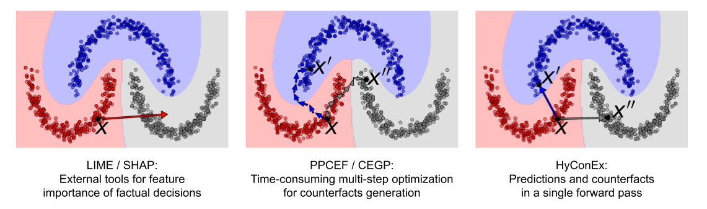

# HyConEx 
Code repository for https://arxiv.org/abs/2503.12525

Repository based on https://github.com/ArlindKadra/IMN and https://github.com/ofurman/counterfactuals

<p align="center">

</p>

## Abstract
In recent years, there has been a growing interest in explainable AI methods. We want not only to make accurate 
predictions using sophisticated neural networks but also to understand what the model's decision is based on. 
One of the fundamental levels of interpretability is to provide counterfactual examples explaining the rationale 
behind the decision and identifying which features, and to what extent, must be modified to alter the model's 
outcome. To address these requirements, we introduce HyConEx, a classification model based on deep hypernetworks 
specifically designed for tabular data. Owing to its unique architecture, HyConEx not only provides class 
predictions but also delivers local interpretations for individual data samples in the form of counterfactual 
examples that steer a given sample toward an alternative class. While many explainable methods generated 
counterfactuals for external models, there have been no interpretable classifiers simultaneously producing 
counterfactual samples so far. HyConEx achieves competitive performance on several metrics assessing 
classification accuracy and fulfilling the criteria of a proper counterfactual attack. This makes HyConEx a 
distinctive deep learning model, which combines predictions and explainers as an all-in-one neural network.

## Setup
Setup with conda environment.

```shell
conda create -n hyconex python=3.11
conda activate hyconex
pip install -r requirements.txt
pip install torch==2.5.1+cu121 --index-url https://download.pytorch.org/whl/cu121
```

## Data

The data folder used for counterfactual experiments can be found under the following [link](data). 
OpenML datasets are downloaded via openml API.

## Experiments
Details of HyConEx configuration hyperparameters can be found in the [hyconex/configs.py](hyconex/configs.py) 
file or can be printed using the following command.

```shell
python train_model.py --help
```
### Train
Default experiment with pre-training phase:
```shell
python train_model.py class_lambda=0.8 dist_lambda=0.1 flow_lambda=0.1 dataset=MOONS pretrain=True
```
Fitting HyConEx using the previously computed pretraining checkpoint:

```shell
python train_model.py class_lambda=0.8 dist_lambda=0.1 flow_lambda=0.1 dataset=MOONS pretrain=False model_load_path="path/to/checkpoint"
```
### Counterfactual examples evaluation
The evaluation of all counterfactual methods on the given HyConEx checkpoint can be performed as follows:
```shell
python counterfactuals_evaluation.py dataset=MOONS device=cpu full_evaluation=True model_load_path="path/to/checkpoint"
```
